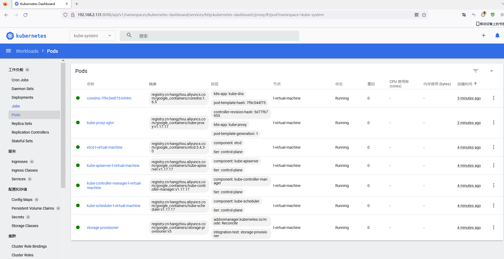

# 安装部署

## minikube

> 使用Ubuntu 20.04

### 安装docker

```
apt install -y docker.io
```

### 安装cri-dockerd

```
wget https://storage.googleapis.com/golang/getgo/installer_linux
chmod +x ./installer_linux
./installer_linux
source ~/.bash_profile
```

```
git clone https://github.com/Mirantis/cri-dockerd.git
cd cri-dockerd
mkdir bin
go build -o bin/cri-dockerd
mkdir -p /usr/local/bin
install -o root -g root -m 0755 bin/cri-dockerd /usr/local/bin/cri-dockerd
cp -a packaging/systemd/* /etc/systemd/system
sed -i -e 's,/usr/bin/cri-dockerd,/usr/local/bin/cri-dockerd,' /etc/systemd/system/cri-docker.service
systemctl daemon-reload
systemctl enable cri-docker.service
systemctl enable --now cri-docker.socket
```

```
VERSION="v1.25.0"
wget https://github.com/kubernetes-sigs/cri-tools/releases/download/$VERSION/crictl-$VERSION-linux-amd64.tar.gz
sudo tar zxvf crictl-$VERSION-linux-amd64.tar.gz -C /usr/local/bin
rm -f crictl-$VERSION-linux-amd64.tar.gz
```

### 安装kubectl

```
curl -LO https://storage.googleapis.com/kubernetes-release/release/`curl -s https://storage.googleapis.com/kubernetes-release/release/stable.txt`/bin/linux/amd64/kubectl
chmod +x ./kubectl
sudo mv ./kubectl /usr/local/bin/kubectl
kubectl version --client
```

### 安装Minikube 

```
apt install conntrack -y
curl -Lo minikube https://storage.googleapis.com/minikube/releases/latest/minikube-linux-amd64  && chmod +x minikube
sudo mkdir -p /usr/local/bin/
sudo install minikube /usr/local/bin/
```

### 运行

查看可支持的版本

```
minikube config defaults kubernetes-version
```

启动集群

```
minikube  start --image-mirror-country=cn  --driver=none  --kubernetes-version=v1.17.17
```

查看pods

```
kubectl get pods --all-namespaces
```

启动仪表盘

```
minikube dashboard
```

配置对外端口

```
kubectl proxy  --port=8088 --address='0.0.0.0' --accept-hosts='^.*'
```

访问URL

```
http://192.168.2.131:8088/api/v1/namespaces/kubernetes-dashboard/services/http:kubernetes-dashboard:/proxy
```



